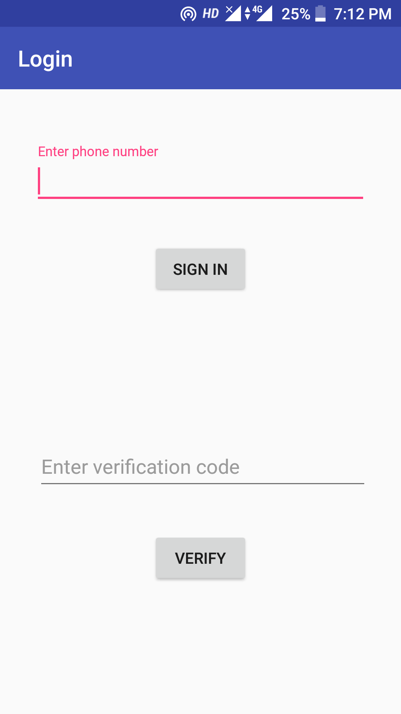
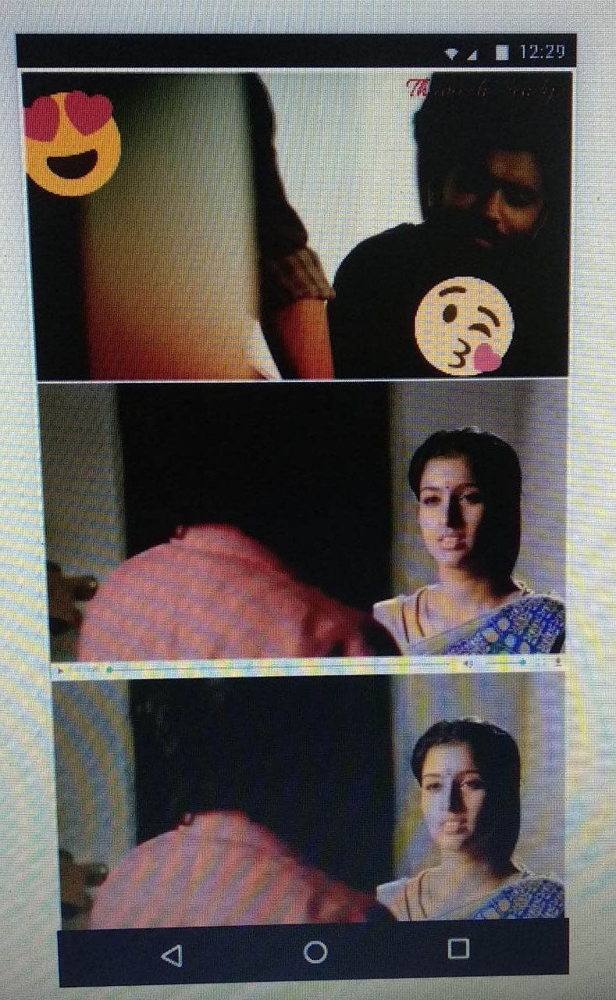

# google drive video hosting as website 

# android webview with google drive videos

### Demo images

Requirements
pip install <package>
  
packages

*pyhton 2.7 or greater*

*google-api-python-client 1.6.6 or greater*

*gspread 3.0.0 or greater*

*httplib2 0.11.3 or greater*

*oauth2client 4.1.2 or greater*           

*oauthlib 2.0.6 r greater*

  
### Clone the repository to get the files
git clone https://github.com/mr-bhuvaneswaran/google-drive-video-hosting

Client_secret.json

  This file is dowloaded in google developers console.

code.gs

  This code has to created in script.google.com

common.py

  Exeute this file using python common.py command

storage.json

  This file has to created as empty and it will be filled once common.py is executed.

status.html

  This is a html file with javscript code to fetch data from google sheets and render the videos.

Status folder

  This folder contails android application code for the simple app for video rendering
  
# Work flow of the project

    commonn.py python file will fetch all the files from google drive using googl api. 
    Adds the sharable link to google sheets with file id.
    The html file will use the script file code.gs created in script.google.com through the link given to the script file.
    The link are used and the video elements are are dynamically added to the html element.
    Android app will use the firebase phone number authentication.
    Uses the webview to show the hosted website inside the android application.
    
  
  
